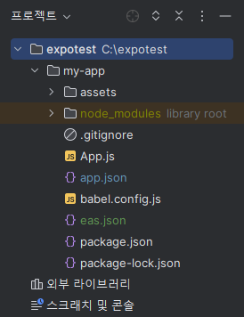

# 리엑트 네이티브 앱 개발환경 세팅

# 세팅 전 요구사항

1. **Node.js**: [공식 홈페이지](https://nodejs.org/ko)에서 “안정적, 신뢰도 높음” 버전을 다운로드 받아 설치
2. **Git:** Git Bash
3. **Expo 계정 생성 및 Expo 앱:** WebView를 사용해 [홈페이지](https://expo.dev/)에서 “Sign Up”을 클릭해 회원가입을 한 후 추가로 앱 구동환경을 제공하기 위해 구글 플레이에서 “Expo” 앱을 다운로드
4. **IDE:** Visual Studio Code를 권장하지만 현 프로젝트에서는 JetBrains사의 WebStorm을 사용

# 리액트 네이티브 환경 세팅

- 자세한 사항은 expo 공식 문서 중, [빌드 설정](https://docs.expo.dev/build/setup/) 문서를 참고할 것
1. 프로젝트를 구현할 새로운 폴더를 생성
    - 오류 발생 방지를 위해 가능한 C드라이브 내부에 만드는 것을 권장하며, 폴더명은 한글이 아닌 영어로 세팅하는 것을 적극 권고함
2. CMD에서 `cd` 명령어를 통해 위 디렉터리로 이동한 다음 아래의 명령어를 통해 필요한 패키지를 설치 및 프로젝트 생성
    - `npm install -g expo-cli` : Expo CLI 패키지를 전역으로 설치
    - `npx create-expo-app my-app` : 새로운 my-app 프로젝트를 생성
    - `npm install -g eas-cli` : EAS 서비스와 상호 작용하기 위한 EAS CLI 설치

3. WebStorm을 실행하여 [파일] - [열기] 메뉴를 통해 위의 폴더를 클릭해 열기
    - 사진과 같이 my-app 디렉터리 아래에 여러 파일들이 보이면 정상적으로 실행된 것임



4. CMD에서 아래의 명령어를 통해 EAS 서비스에 로그인
    - 이제부터 윈도우의 CMD가 아닌 WebStorm에 내장되어 있는 CMD를 사용해도 무관함
    - 수행 전, Expo 계정이 있으야 하므로, 없다면 [Expo 홈페이지](https://expo.dev/)에서 회원가입 후 진행
    - `eas login` : 사용자의 이메일(혹은 아이디)와 비밀번호를 입력하여 로그인 수행
5. EAS Build용 어플리케이션 프로젝트를 구성하기 위해 아래의 명령어를 입력
    - `eas build:configure` : EAS 프로젝트 구성
        - 만약 `**Error: Run this command inside a project directory**`와 같은 오류 메시지가 발생한다면 잘못된 디렉터리에서 빌드를 실행하려고 하기 때문에 나오는 오류임.
        - 따라서 위 오류 발생 시 `cd my-app`을 통해 프로젝트가 있는 디렉터리에 이동한 다음 다시 `eas build:configure` 명령어를 실행
    - Windows 환경에서 진행할 경우 Android 프로젝트만 사용 가능함.
    따라서 EAS Build 선택지가 나올 경우 이동키와 Enter키를 이용해 `Android`를 선택

# 앱 구성 및 APK 배포

- 자세한 사항은 expo 공식 문서 중, [APK 빌드](https://docs.expo.dev/build-reference/apk/) 문서를 참고할 것
1. WebStorm에서 eas.json 파일 수정
    - `"build": { ... }`  부분을 아래의 코드로 변경
    
    ```java
    "build": {
        "preview": {
          "android": {
            "buildType": "apk"
          }
        },
        "preview2": {
          "android": {
            "gradleCommand": ":app:assembleRelease"
          }
        },
        "preview3": {
          "developmentClient": true
        },
        "production": {}
      }
    ```
    
2. 내부 CMD에서 디렉터리 위치가 my-app 인 것을 확인한 후 아래의 명령어를 입력
    - `eas build -p android --profile preview` : APK 빌드 실행
    - 위 명령어는 시간이 조금 걸리는 점 참고
3. 앱의 정보를 입력
    - `What would you like your Android application id to be? >>`
        - CMD에서 위와 같은 입력창이 뜨면 com.honggildong.myapp 처럼 고유한 이름과 앱 이름을 순차대로 입력하여 고유ID를 설정
        - 고유 ID는 집 주소처럼 회사명-부서명-팀명-프로젝트명 형식으로 프로젝트를 식별할 수 있으면서 고유한 이름으로 작명하면 됨
        - 입력할 때 한글은 입력 불가. 영어로만 작성해야 함
    - `Generate a new Android Keystroe? >>` → `Y` 입력
        - Keytool, Keystore 등 빌드에 필요한 여러 요소를 자동으로 설정함
4. 시간이 지나고 안드로이드 앱을 다운받을 수 있는 링크가 나옴
    - CMD에 "https://expo.dev/artifacts/eas/hf…qW.apk" 와 같은 링크를 통해 APK를 다운받을 수 있음
    - 위 APK를 다운받아 스마트폰에 설치하면 “Open up App.js to start working on your app!” 이라는 문구와 함께 정상적으로 설치됨을 확인할 수 있음.

# 앱 아이콘 및 스플래시 이미지 변경

- my-app 내부의 assets 폴더에 있는 여러 이미지 파일을 수정하면 됨. 각 이미지에 대한 설명은 아래와 같음
    - **adaptive-icon.png:** 적응형(Adaptive) 아이콘 이미지
    - **favicon.png:** 브라우저에서 접속했을 때 탭에 보이는 작은 이미지.
    이는 웹에서 동작할 때 사용하는 이미지이므로 앱 개발에서는 신경쓰지 않아도 괜찮음.
    - **icon.png:** 기본(Legacy) 아이콘 이미지.
    - **splash.png:** 앱을 실행했을 때 로딩화면에 나오는 이미지. 스플래시 이미지라고 함.
- 적응형과 기본 아이콘의 차이는 [여기 블로그 글](https://carrotdesign.tistory.com/entry/%EC%95%88%EB%93%9C%EB%A1%9C%EC%9D%B4%EB%93%9C-%EC%A0%81%EC%9D%91%ED%98%95-%EC%95%B1%EC%95%84%EC%9D%B4%EC%BD%98-%EB%A7%8C%EB%93%A4%EA%B8%B0-Adaptive-icon-fin2)을 참고할 것

1. 프로젝트를 파일 탐색기에서 열어 “adaptive-icon.png”, “icon.png”, “splash.png” 3개의 이미지를 변경
    - assets 폴더에서 우클릭 - [다음에서 열기] - [Explorer] 메뉴를 클릭하면 됨
    - 수정할 때, 이미지의 가로*세로 크기는 일치해야 하므로, 제작할 때 주의할 것.
        - **adaptive-icon.png 및 icon.png:**1024px * 1024px
        - **splash.png:** 1284px * 2778px
2. 이미지 파일을 저장한 후 CMD에서 아래의 명령어 실행
    - `eas build -p android --profile preview` : 바뀐 코드를 적용하고 빌드 실행
    - 빌드 과정이 시간이 오래 걸리니 감안할 것
3. 시간이 지나고 안드로이드 앱을 다운받을 수 있는 링크가 나옴
    - CMD에 "https://expo.dev/artifacts/eas/hf…qW.apk" 와 같은 링크를 통해 APK를 다운받을 수 있음
    - 위 APK를 다운받아 스마트폰에 설치하면 아이콘과 스플래시 이미지가 변경된 것을 확인할 수 있음.