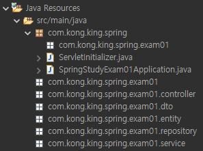
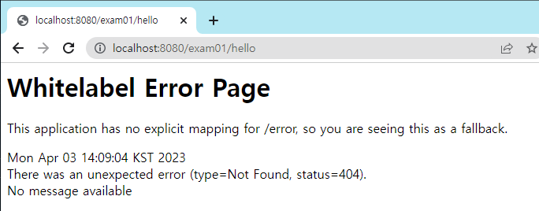
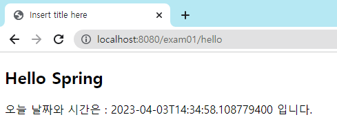
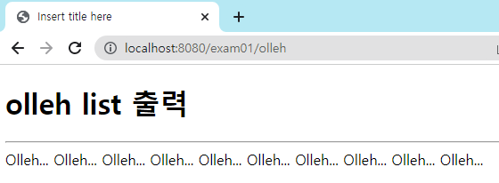
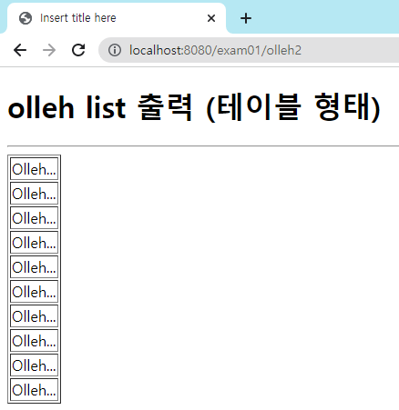
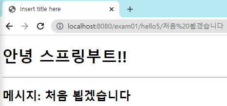
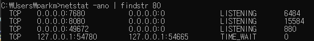
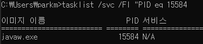

# 스프링 JSP 파일 매핑 연습

- 강의 교수: 김기종
- 강의 언어: JSP
- 과목: 웹프로그래밍II
- 날짜: 2023년 4월 3일 오후 1:00
- 유형: 실습
- 작성일시: 2023년 4월 3일 오후 1:15
- 작성자: 박진석

# 프로젝트 기본 환경 구성

- **참고사항**
    - 최신버전의 이클립스를 사용할 경우 JDK를 1.7 이상의 버전을 사용하는 것을 적극 권장함.
    - 참고로, 이클립스에서 Spring 3 버전은 레거시 버전, Spring 4는 Boot 버전을 포함한 것.
    - JAR 파일은 자바 클래스와 리소스를 패키징하고 배포하는데 사용되며, WAR 파일은 웹 애플리케이션을 패키징하고 배포하는데 사용

1. [Spring Starter Project]를 사용하여 새로운 스프링 프로젝트를 생성
    - 웹 통신도 필요한 프로젝트이므로, Packaging을 War으로 설정
    - 스프링부트 버전은 2.x 버전이 안정성이 좋으므로 해당 버전 사용하는 것을 권장
    - Dependency는 Lombok, Spring Boot DevTools, Spring Web을 지정
2. pom.xml에 JSP, JSTL 사용을 위해 새로운 dependency를 설정.
즉, pom.xml에 아래와 같은 코드를 `<dependencies>` 태그 내부에 작성
    - 아래 코드 작성을 완료했다면 pom.xml 우클릭한 후 [Maven] - [Update Project]를 실행

```xml
<dependency>
	<groupId>org.apache.tomcat.embed</groupId>
	<artifactId>tomcat-embed-jasper</artifactId>
	<scope>provided</scope>
</dependency>
<dependency>
	<groupId>javax.servlet</groupId>
	<artifactId>jstl</artifactId>
</dependency>
```

1. [Java Resources] - [src/main/resources] 내부에 있는 application.properties에 아래 내용을 작성

```
spring.mvc.view.prefix=/WEB-INF/views/
spring.mvc.view.suffix=.jsp
```

1. src/main/webapp 디렉터리 내부에 WEB-INF 폴더를 만들고, 그 폴더 내부에 views 폴더를 만듦
2. 새로운 패키지를 src/main/java 내부에 6개의 패키지를 아래와 같이 생성



# 기초 테스트 파일 구성

1. src/main/webapp/WEB-INF/views 디렉터리 내부에 hello.jsp를 생성
    - <body> 부분에 아래와 같은 코드 입력
    
    ```html
    <h2>Hello Spring</h2>
    오늘 날짜와 시간은 : <%=java.time.LocalDateTime.now()%> 입니다.
    ```
    
    - 만약 어노테이션 내부에서 오류가 난다면 아래의 두가지 방법을 사용해볼 것
        - 맨 위에 `<%@page import="java.time.LocalDateTime"%>` 을 삽입
        - `java.time.LocalDateTime.` 까지만 작성하고, 뒤의 `now()`를 입력할 때는 n 까지만 우선 입력한 후 이클립스에서 제공하는 자동입력을 이용해서 `now()` 메서드를 입력
    - 아직은 라우팅이 되어있지 않기 때문에 서버를 실행하면 아래와 같은 오류 메시지가 나올 것임. 이를 방지하기 위해 2번 단계를 수행하자
    
    
    
2. controller 패키지에 Exam01Controller.java 파일을 생성하고, 아래의 코드를 입력
    
    ```java
    package com.kong.king.spring.exam01.controller;
    
    import org.springframework.stereotype.Controller;
    import org.springframework.web.bind.annotation.GetMapping;
    import org.springframework.web.bind.annotation.RequestMapping;
    
    @Controller
    @RequestMapping("/exam01")
    public class Exam01Controller {
    
    	@GetMapping("/hello")
    	public String helllo() {
    		return "hello";
    	}
    }
    ```
    
    - 이는 “/exam”으로 시작하는 주소체계 중, “hello”라는 키워드로 끝나는 주소는 hello.jsp를 `return` 한다는 코드임.
    - 여기서 .jsp와 /views 디렉터리는 application.properies 파일 내부에 `spring.mvc.view.prefix=` , `spring.mvc.view.suffix=` 명령어를 통해 미리 설정값을 작성하였으므로 따로 건들이지 않아도 알아서 라우팅 처리를 자동으로 처리함
3. 서버 실행
    - `main` 메소드가 있는 SpringStudyExam01Application.java 를 찾아 우클릭하여
    [Run as] - [Spring Boot App] 을 클릭하여 서버를 실행시킬 수 있음.
    - 웹 브라우저에서 [http://localhost:8080/exam01/hello](http://localhost:8080/exam01/hello) 를 입력하면 hello.jsp 파일이 실행되는 것을 확인할 수 있음
    
    
    

# 새로운 파일 추가

1. hi.jsp 파일을 views 디렉터리 아래에 생성한 후 `<h1>` 태그를 이용해 문장을 입력
2. Exam01Controller.java 파일 속 새로운 메서드를 아래와 같이 추가
    
    ```java
    // 중략
    	@GetMapping("/hello")
    	public String hello() {
    		return "hello";
    	}
    
    	@GetMapping("/hello2")
    		public String goodMorning() {
    			return "hi";
    		}
    }
    ```
    
    - 위 코드에서 볼 수 있듯이, **메소드 명은 아무렇게 지어도 무방**하며, 중요한 것은 어노테이션을 작성할 때의 **매핑명과 return 값이 중요**한 것을 알 수 있음.
3. 파일 저장 및 서버 재실행 후 [http://localhost:8080/exam01/hello2](http://localhost:8080/exam01/hello2) 주소로 접속하면 hi.jsp 파일의 내용이 보이는 것을 확인할 수 있음.

## 다른 디렉터리의 파일 추가

1. 이번에는 views 폴더 내부에 새로운 board 폴더를 만들어 hello3.jsp를 생성한 후 자유롭게 내용을 작성
2. Controller 클래스에 아래의 코드를 추가함
    
    ```java
    @GetMapping("/hello3")
    	public String hello3() {
    		return "board/hello3";
    	}
    ```
    
    - 위 코드에서 볼 수 있듯, `return` 값으로 적절한 디렉터리 위치값만 설정해주면 해당 파일에 어디에 있든 라우팅 할 수 있음.
3. [http://localhost:8080/exam01/hello3](http://localhost:8080/exam01/hello3) 주소로 접속하면 해당 hello3.jsp 파일의 내용이 보이는 것을 확인할 수 있음.

## 두 페이지를 하나의 URL로 관리

1. views 하위폴더로 exam01을 만든 후 olleh.jsp, olleh2.jsp를 각각 아래 코드로 작성함
    - `<c:forEach>` JSTL을 사용하므로, 선언부에 `taglib`을 통해 JSTL 사용 선언을 해야함
    
    ```html
    <!-- olleh.jsp -->
    <%@ page language="java" contentType="text/html; charset=UTF-8"
        pageEncoding="UTF-8"%>
    <%@ taglib uri="http://java.sun.com/jsp/jstl/core" prefix="c"%>
    <!-- head와 html 생략 -->
    <body>
    	<h1> olleh list 출력</h1>
    	<hr>
    	<c:forEach items="${olleh}" var="o">
    		${o}
    	</c:forEach>
    </body>
    ```
    
    ```html
    <!-- olleh2.jsp -->
    <%@ page language="java" contentType="text/html; charset=UTF-8"
        pageEncoding="UTF-8"%>
    <%@ taglib uri="http://java.sun.com/jsp/jstl/core" prefix="c"%>
    <!-- head와 html 생략 -->
    <body>
    	<h1>olleh list 출력 (테이블 형태)</h1>
    	<hr>
    	<table border="1">
    	  <c:forEach items="${olleh}" var="o">
    		  <tr><td>${o}</td></tr>
    	  </c:forEach>
    	</table>
    </body>
    ```
    
    - 위의 `forEach`문을 설명하면, `olleh` 이름의 변수에서 값을 하나씩 꺼내 임시변수 `o`에 담은 후, `${o}` 자리에 하나씩 출력하겠다는 의미임.
    - 두 jsp의 차이점은 `o` 출력을 단순 텍스트 나열이냐, table 형태로 할것이냐의 차이.
2. Controller 클래스에 아래의 새로운 메서드를 추가
    
    ```java
    @GetMapping({"/olleh", "/olleh2"})
    	public void olleh(Model model) {
    		List<String> list = new ArrayList<String>();
    		
    		for(int i = 0; i < 10; i++) {
    			list.add("Olleh...");
    		}
    		
    		model.addAttribute("olleh", list);
    	}
    ```
    
    - 새로운 String 값을 담는 10 크기의 ArrayList `list`를 만들고, “Olleh…” 텍스트를 10개 담음. 그 후, 해당 `list`를 model 객체에 담아 `olleh` 이름으로 저장 및 전송(`addAttribute()`)
3. 이후 각각의 주소로 입력하여 서버에 접속하면 아래와 같이 “Olleh…”가 틀에 맞춰 반복하여 출력됨을 확인할 수 있음.





## URL에서 데이터 가져오기

1. Exam01Controller.java 에 아래의 새로운 메서드를 추가
    
    ```java
    public String hello4(@RequestParam(value="msg", required=false) String msg) {
    		return msg;
    }
    ```
    
    - `RequestParam` 어노테이션을 사용해 URI 주소에서 `msg` 이름의 변수값을 가져올 수 있음.
        - 참고로, `required = false` 속성을 입력하면 `msg` 변수가 발견되지 않아도 `Bad Request, Required String parameter 'msg' is not present` 예외를 발생치 않도록 함.
2. 주소창에 hello4와 함께 msg=… 에 원하는 값을 넣고 접속하면 값이 바로 출력됨


## 더 간단히 URL 데이터 가져오기

1. views 폴더에 hello5.jsp를 만들어 아래와 같이 코딩
    
    ```html
    <!-- body 부분에 삽입할 것 -->
    <h1>안녕 스프링부트!!</h1>
    <hr>
    <h2>메시지: ${msg}</h2>
    ```
    
2. Exam01Controller.java 에 아래의 새로운 메서드를 추가
    
    ```java
    @GetMapping("/hello5/{msg}")
    	public String hello5(@PathVariable String msg, Model m) {
    		m.addAttribute("msg" ,msg);
    		return "hello5";
    	}
    ```
    
    - `GetMapping` 어노테이션의 `{...}` 문법과 `PathVariable` 어노테이션을 사용해 `...` 부분의 값을 바로 가져올 수 있음.
        - URL의 `msg` 부분을 가져와 `Model` 객체 `m`에 `msg`값을 입력하고 hello5.jsp에 라우팅함
3. 서버를 실행하면 기존의 `?msg=...` 붙이는 것 없이 바로 `/` 이후에 값을 입력해도 값이 잘 전달되는 것을 확인할 수 있음.



# 포트 충돌 에러 해결법

```
Error starting ApplicationContext. To display the conditions report re-run your application with 'debug' enabled.

***************************
APPLICATION FAILED TO START
***************************

Description:
Web server failed to start. Port 8080 was already in use.

Action:
Identify and stop the process that's listening on port 8080 or configure this application to listen on another port.
```

- 이미 서버가 실행되고 있는 상황에서 중지하지 않고 새로운 서버 실행 시도하면 위와 같이 오류가 발생할 수 있음
- 이럴 경우 CMD를 실행시켜 해당 포트를 사용하고 있는 프로세스를 강제로 중지시킴으로 해결할 수 있음.

1. CMD를 실행하여 `netstat -ano | findstr 80` 명령어를 통해 포트번호가 80과 관련된 프로세스를 검색해 해당 포트번호의 PID를 확인



1. `tasklist /svc /FI "PID eq 15584"` 명령어를 통해 해당 PID를 가진 프로세스 상세 정보를 확인
    - 위 예시에서는 `0.0.0.0:8080` 를 사용중인 PID가 `15584` 임을 확인하였으므로 `eq` 뒤에 숫자 `15584`를 입력하였음



1. `taskkill /f /pid 15584` 명령어를 통해 해당 PID를 가진 프로세스를 강제로 중지시킴

